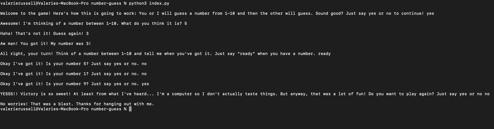

# Number Guessing Game

## Overview

A simple number guessing game built with Python.

## Description

I built a simple CLI using Python to create a number guessing game so that I could implement basic Python concepts into a useful application. I had the opportunity to utilize several concepts: Python functions, conditional execution, f-strings (unique to Python3), the random library, a list, and methods like .isnumeric(), int(), and .remove().

Project-based learning is one of my favorite ways to understand new languages and technologies. I truly enjoyed building this application since it gave me the opportunity to learn more about Python syntax and strategies, while also applying what I do know about high-level programming concepts.

## Technologies Used

- Python

## Installation

No installation steps are required to view this project. The repository can be cloned locally, then the index.py file can be run by navigating to the correct folder in the command line and running ```python3 index.py```.

## Usage

This is a simple guessing game intended for entertainment purposes only, while showcasing basic capabilities within Python.

Below is a screenshot of the CLI in action:



## Credits

Valerie Russell was the sole contributor to this project. Contact her at vruss14@gmail.com.
